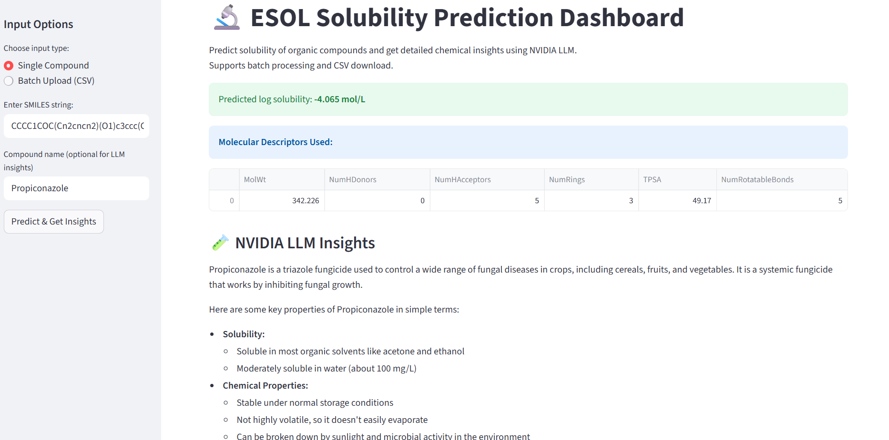
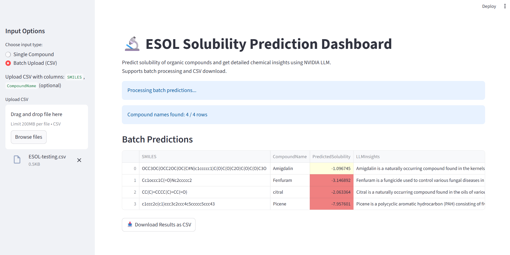

# 🧪 Molecular Solubility Predictor (ESOL)


---

## 📘 **Project Overview**

This project predicts the **aqueous solubility (log mol/L)** of chemical compounds using the **ESOL dataset** and molecular descriptors computed via **RDKit**.  
Through Exploratory Data Analysis (EDA), feature engineering, and machine learning models, this project builds an interpretable QSAR (Quantitative Structure–Activity Relationship) framework to understand how molecular features affect solubility.

---

## 🧩 **Objectives**
- Generate molecular descriptors using RDKit 🧬  
- Perform comprehensive EDA to understand chemical behavior  
- Train and evaluate multiple ML models for solubility prediction  
- Use SHAP for feature interpretability and chemical insight  
- Provide a reproducible pipeline for cheminformatics tasks  

---

## ⚙️ **Workflow**

1. **Data Loading & Preprocessing**  
   - Load ESOL dataset (1,128 compounds)  
   - Standardize SMILES input (auto-detects lowercase/uppercase issues)  
   - Compute descriptors: *MolWt, TPSA, NumRings, NumRotatableBonds, NumHDonors, NumHAcceptors*  

2. **Exploratory Data Analysis (EDA)**  
   - Distribution plots for molecular features  
   - Pairwise correlation heatmaps  
   - Pairplots for inter-feature relationships  
   - 3D visualizations of complexity vs solubility  

3. **Model Training & Evaluation**  
   Models tested:
   - 🌲 **Random Forest Regressor**
   - ⚡ **Gradient Boosting Regressor**
   - 🌳 **Extra Trees Regressor**

4. **Model Explainability**  
   - SHAP summary plots to interpret feature impact  
   - Feature ranking and importance analysis  

---

## 📊 **Model Performance**

| Model                | RMSE  | R² Score |
|----------------------|:-----:|:--------:|
| 🌲 Random Forest     | 0.911 | 0.825 |
| ⚡ Gradient Boosting | 0.837 | 0.852 |
| 🌳 Extra Trees       | 0.883 | 0.835 |

> ✅ **Gradient Boosting** showed the best predictive accuracy, while **Random Forest** remains the most robust and interpretable for deployment.

---

## 🔍 **Key Insights**

### 🔬 Feature Relationships
- **Molecular Weight (MolWt):** Negatively correlated with solubility  
- **TPSA:** Strong positive effect — polar molecules dissolve better  
- **NumRotatableBonds:** More flexibility → lower solubility  
- **NumHDonors:** Positive effect due to hydrogen bonding  
- **NumRings:** Slight negative impact  
- **NumHAcceptors:** Minimal isolated effect  

### 📈 Complexity vs Solubility
- Higher TPSA → higher solubility  
- Increased rings and molecular weight → lower solubility  
- Combination of multiple descriptors defines solubility rather than a single one  

### 💡 SHAP Interpretations
- Top contributors: **MolWt, TPSA, NumRotatableBonds**
- SHAP values confirm chemical intuition: heavier, flexible molecules are less soluble; polar compounds are more soluble.

---

## 🧠 **Conclusions**

- Tree-based ML models capture non-linear chemical relationships effectively.  
- **MolWt**, **TPSA**, and **NumRotatableBonds** are critical predictors of solubility.  
- Results validate the use of QSAR-based modeling for molecular property prediction.  
- The workflow can easily extend to other chemical datasets for property prediction.  

---

## 🚀 **Recommendations**

- Use **Random Forest** for robust deployment pipelines  
- Consider **feature interaction terms** (e.g., `MolWt/TPSA`) for enhanced performance  
- Apply **log-transformations** to skewed features for better generalization  
- Incorporate **outlier analysis** to identify unique molecular behaviors  
- Extend project with a **Streamlit dashboard** for live solubility predictions  

---

## 🧰 **Tech Stack**

| Category | Tools |
|-----------|-------|
| Language | Python 🐍 |
| Libraries | RDKit, Pandas, NumPy, Matplotlib, Seaborn, Scikit-Learn, SHAP |
| Model Types | Tree-based Regressors |
| Visualization | Pairplots, SHAP, Scatter/Heatmaps |
| Environment | Jupyter Notebook / VS Code |

---

## 📂 **Repository Structure**
```
esol-solubility-predictor/
├─ app.py                      # demo app (Flask/Streamlit) to query the trained model
├─ requirements.txt            # pinned Python dependencies
├─ data/
│  └─ ESOL.csv                 # raw ESOL dataset used for training and analysis
├─ models/                     # (optional) serialized model artifacts (pickle/joblib)
├─ notebooks/
│  └─ ESOL-Prediction.ipynb    # EDA, modeling pipeline, hyperparameter tuning, evaluation
└─ README.md                   # project overview (this file)
```

---

## �️ Demo screenshots

### Single-compound prediction (Streamlit)
The single-compound view lets users paste a SMILES string and receive an immediate predicted logS value, plus feature contributions.



### Batch upload / Bulk predictions (Streamlit)
Upload a CSV of SMILES (or descriptors) to run bulk predictions and download the results with predicted solubility values appended.



---

## �📚 **References**
- Delaney, J. S. (2004). **ESOL: Estimating Aqueous Solubility Directly from Molecular Structure.** *Journal of Chemical Information and Computer Sciences, 44(3), 1000–1005.*
- RDKit: Open-source cheminformatics library (https://www.rdkit.org)
- Scikit-learn Documentation (https://scikit-learn.org)

---

## 👨‍💻 **Author**
**Prateek Kumar Prasad**  
📍 *B.Tech in CSE (Data Science), K.R. Mangalam University*  
🔗 [LinkedIn](https://www.linkedin.com/in/prateekkp) | [GitHub](https://github.com/prateekkp)  

> *“Analyzing molecules through data, one feature at a time.”* ⚗️

---
